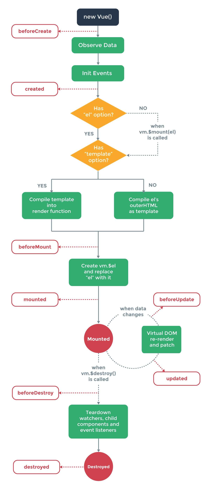

&emsp;&emsp;前面粗略了看了一下vue2.0的官方文档，对很多重要的概念没有仔细思考。生命周期是vue最核心的产物，所以本篇将对此进行一下梳理，话不多说，先上图：

&emsp;&emsp;1.创建Vue实例，`new Vue()`。
&emsp;&emsp;2.初始化数据，在此之前，有一个beforeCreate钩子被调用。
&emsp;&emsp;3.创建数据监测、内部事件初始化。
&emsp;&emsp;4.数据初始化完成，created钩子被调用。
&emsp;&emsp;5.找到组件的挂载位置：如果Vue实例中包含有声明的el属性值，那么el的值就是组件的挂载点。否则调用Vue的`$mount`方法对组件进行手动挂载，`$mount`的参数就是组件要挂载的节点的选择器。
&emsp;&emsp;6.检查组件是否有template模块，如果没有，那么直接编译挂载点的内容；如果有，将之前初始化的数据和template内容进行组装编译，产生一段完整的html内容
&emsp;&emsp;7.接下来要将产出的html对el挂载点的内容进行替换，但在此之前beforeMounte钩子要被调用。
&emsp;&emsp;8.将挂载点的内容替换成之前产出的html内容。此时文档当中才真正呈现template中包含的内容。
&emsp;&emsp;9.调用mounted钩子。如果有节点操作和服务端数据请求应该放在`mounted`钩子里。
&emsp;&emsp;10.服务端请求的数据返回后要执行数据集的更新，准备重新渲染DOM节点，调用beforeUpdate钩子，如果要对结果集进行进一步的处理，在这个钩子里处理是最佳时机，因为它不会导致重复渲染，不会影响性能 。
&emsp;&emsp;11.重新渲染DOM节点。
&emsp;&emsp;12.节点渲染完成，调用updated钩子。注意：在updated钩子里不应该再更改数据状态，因为在这里更改数据状态会导致节点无限循环渲染，导致内存泄漏。
&emsp;&emsp;13.如果调用了Vue实例的`$destroy`方法，先调用beforeDestroy钩子。
&emsp;&emsp;14.Vue实例的所有绑定的东西都要被解除，包括数据观测和事件监听器，子实例也会随之被销毁。
&emsp;&emsp;15.调用destroyed钩子。至此，一个Vue实例完成了它光荣的使命！